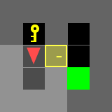
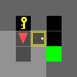
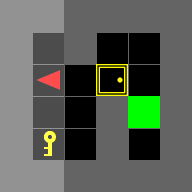
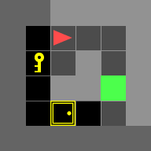
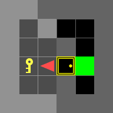
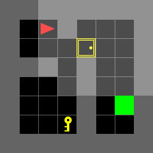
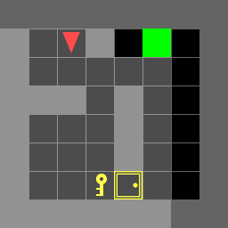
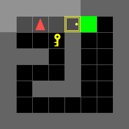

# Optimal Control Dynamic Programming

## Overview
In this assignment, you are required to implement dynammic programming for the Door-Key problems.
<p align="center">
</br>
</p>

There are 7 test scenes you have to test and include in the report.

|           doorkey-5x5-normal            |
| :-------------------------------------: |
|  |

|           doorkey-6x6-normal            |            doorkey-6x6-direct            |            doorkey-6x6-shortcut            |
| :-------------------------------------: | :--------------------------------------: | :----------------------------------------: |
|  |  |  |

|           doorkey-8x8-normal            |            doorkey-8x8-direct            |            doorkey-8x8-shortcut            |
| :-------------------------------------: | :--------------------------------------: | :----------------------------------------: |
|  |  |  |

## Installation

- Install Python version `3.7 ~ 3.10`
- Install dependencies
```bash
pip install -r requirements.txt
```

## Instruction
### 1. doorkey.py
You will need to modify **doorkey.py** as the main entrance.

I have created two different file - 

* **doorkeyA.py** - This solves the problem for known environments and runs the value iteration for all the environments
* **doorkeyB.py** - This solves the problem for random environments and runs the value iteration only once. The optimal policy and value functions are stored as `.npy` files in the folder. If they are missing the value iteration is run once before evaluating over all environments.


### 2. utils.py
You might find some useful tools in utils.py
- **step()**: Move your agent
- **generate_random_env()**: Generate a random environment for debugging
- **load_env()**: Load the test environments
- **save_env()**: Save the environment for reproducing results
- **plot_env()**: For a quick visualization of your current env, including: agent, key, door, and the goal
- **draw_gif_from_seq()**: Draw and save a gif image from a given action sequence.

### 3. GIF Folder
The gif folder contains the results for all environments known or random. It contains the gif and every frame along with the optimal sequence. The **doorkeyB.py** should be run to get the results for random environments.


### 4. example.py
The example.py shows you how to interact with the utilities in utils.py, and also gives you some examples of interacting with gym-minigrid directly.
